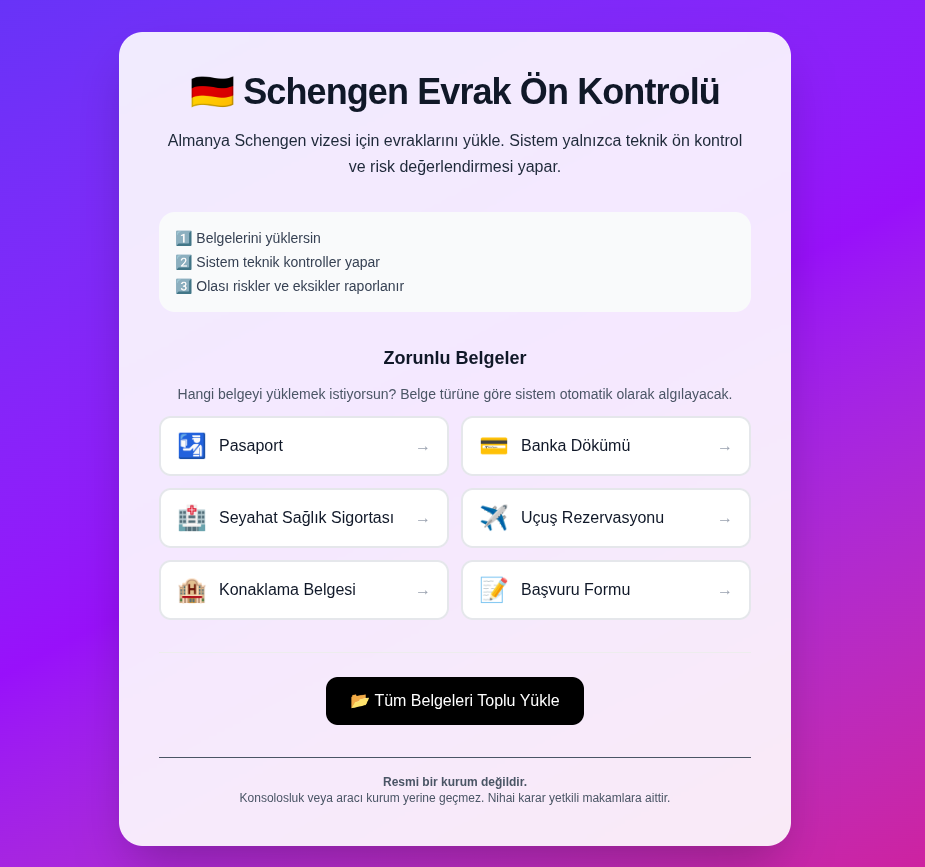
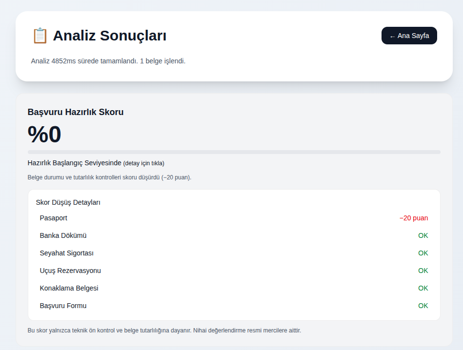
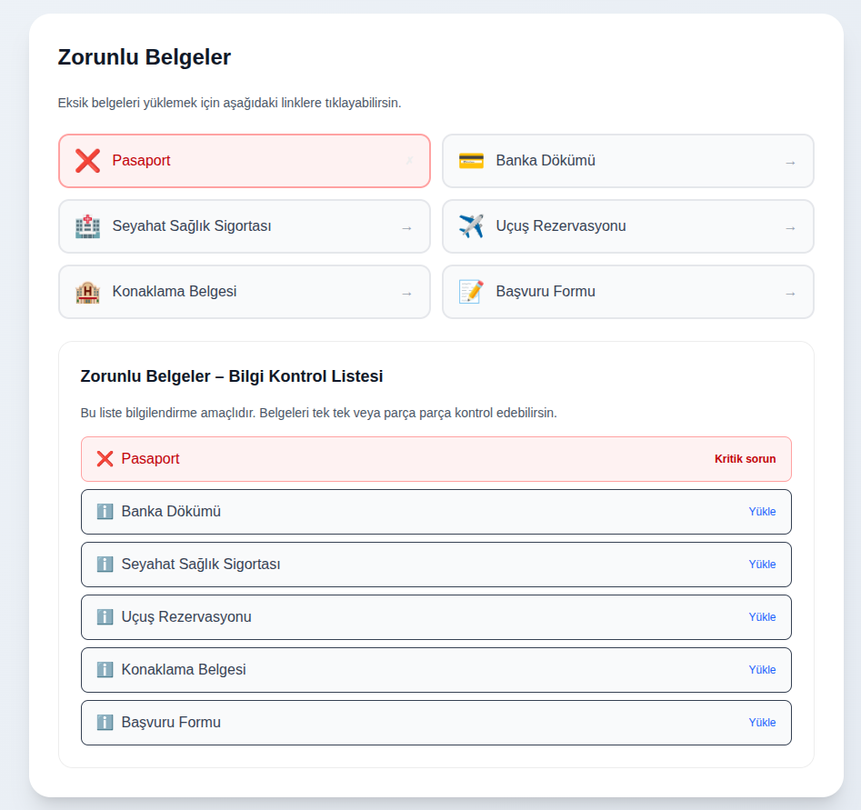
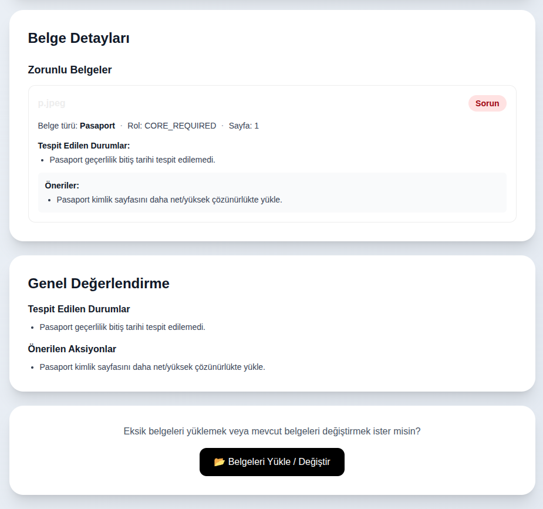

# 🇩🇪 Schengen Evrak Ön Kontrolü

Almanya Schengen vizesi için belgelerin teknik ön kontrolünü ve risk değerlendirmesini yapan web uygulaması.

##  Ekran Görüntüleri

### Ana Sayfa - Belge Seçimi


### Yükleme Sayfası


### Sonuç Sayfası - Hazırlık Skoru


### Belge Detayları


### Belge Kontrol Listesi


##  İçindekiler

- [Özellikler](#-özellikler)
- [Teknolojiler](#-teknolojiler)
- [Proje Yapısı](#-proje-yapısı)
- [Kurulum](#-kurulum)
- [Kullanım](#-kullanım)
- [API Endpoints](#-api-endpoints)
- [Belge Türleri](#-belge-türleri)
- [Geliştirme](#-geliştirme)
- [Notlar](#-notlar)

##  Özellikler

- **Otomatik Belge Tanıma**: Pasaport, banka dökümü, seyahat sigortası, uçuş rezervasyonu, konaklama belgesi ve başvuru formunu otomatik olarak tanır
- **OCR Desteği**: PDF ve görüntü formatlarında belgeleri OCR ile okur
- **Tarih Kontrolü**: Belgelerdeki tarihleri kontrol eder ve tutarlılık analizi yapar
- **Risk Değerlendirmesi**: Her belge için kritik, uyarı veya uygun durum tespiti yapar
- **Hazırlık Skoru**: Başvuru hazırlık seviyesini yüzdelik skor olarak gösterir
- **KVKK Uyumlu**: Belgeler kalıcı olarak saklanmaz, analiz sonrası otomatik silinir
- **Türkçe Arayüz**: Tam Türkçe kullanıcı arayüzü

##  Teknolojiler

### Frontend
- **Next.js 16** - React framework
- **TypeScript** - Tip güvenliği
- **Tailwind CSS 4** - Styling
- **Framer Motion** - Animasyonlar

### Backend
- **FastAPI** - Python web framework
- **PyMuPDF (fitz)** - PDF işleme
- **Pillow (PIL)** - Görüntü işleme
- **Tesseract OCR** - Metin tanıma
- **Uvicorn** - ASGI server

##  Proje Yapısı

```
schengen-precheck-web/
├── app/                          # Next.js frontend
│   ├── components/               # React bileşenleri
│   │   ├── DocumentCheckList.tsx # Belge kontrol listesi
│   │   ├── FileResult.tsx        # Belge sonuç kartı
│   │   ├── PreparationScore.tsx  # Hazırlık skoru
│   │   └── ...
│   ├── page.tsx                  # Ana sayfa
│   ├── upload/                   # Yükleme sayfası
│   │   └── page.tsx
│   ├── result/                   # Sonuç sayfası
│   │   └── page.tsx
│   └── types.tsx                 # TypeScript tipleri
│
└── schengen-precheck-api/        # FastAPI backend
    ├── main.py                   # Ana API dosyası
    ├── requirements.txt          # Python bağımlılıkları
    └── venv/                     # Python virtual environment
```

##  Kurulum

### Gereksinimler

- **Node.js** 18+ ve npm
- **Python** 3.10+
- **Tesseract OCR** (sistem bağımlılığı)

### 1. Tesseract OCR Kurulumu

#### Ubuntu/Debian:
```bash
sudo apt-get update
sudo apt-get install tesseract-ocr
sudo apt-get install tesseract-ocr-tur  # Türkçe dil desteği (opsiyonel)
```

#### macOS:
```bash
brew install tesseract
brew install tesseract-lang  # Dil paketleri
```

#### Windows:
[Download Tesseract installer](https://github.com/UB-Mannheim/tesseract/wiki) ve PATH'e ekleyin.

### 2. Frontend Kurulumu

```bash
# Proje dizinine git
cd schengen-precheck-web

# Bağımlılıkları yükle
npm install

# Geliştirme sunucusunu başlat
npm run dev
```

Frontend `http://localhost:3000` adresinde çalışacak.

### 3. Backend Kurulumu

```bash
# Backend dizinine git
cd schengen-precheck-api

# Virtual environment oluştur
python3 -m venv venv

# Virtual environment'ı aktifleştir
source venv/bin/activate  # Linux/macOS
# veya
venv\Scripts\activate  # Windows

# Bağımlılıkları yükle
pip install -r requirements.txt
```

### 4. Backend'i Başlatma

```bash
# Virtual environment aktifken
uvicorn main:app --host 127.0.0.1 --port 8000 --reload
```

Backend `http://127.0.0.1:8000` adresinde çalışacak.

**Arka planda çalıştırmak için:**
```bash
nohup uvicorn main:app --host 127.0.0.1 --port 8000 --reload > /tmp/backend.log 2>&1 &
```

##  Kullanım

### 1. Uygulamayı Başlat

**Terminal 1 - Frontend:**
```bash
cd schengen-precheck-web
npm run dev
```

**Terminal 2 - Backend:**
```bash
cd schengen-precheck-web/schengen-precheck-api
source venv/bin/activate
uvicorn main:app --host 127.0.0.1 --port 8000 --reload
```ı

### 2. Belgeleri Yükle

1. Tarayıcıda `http://localhost:3000` adresine git
2. Ana sayfada belge türüne tıkla (Pasaport, Banka Dökümü, vb.)
3. Veya "Tüm Belgeleri Toplu Yükle" ile birden fazla belge yükle
4. PDF veya görüntü formatında belgeleri seç
5. Gizlilik politikası ve onayları kabul et
6. "Analiz Et" butonuna tıkla

### 3. Sonuçları İncele

- **Hazırlık Skoru**: Başvuru hazırlık seviyesi (0-100%)
- **Belge Detayları**: Her belge için durum, tespit edilen sorunlar ve öneriler
- **Tutarlılık Kontrolü**: Belgeler arası tarih uyumu
- **Eksik Belgeler**: Yüklenmemiş zorunlu belgeler

## 🔌 API Endpoints

### `GET /`
Backend durumunu kontrol eder.

**Response:**
```json
{
  "status": "api running"
}
```

### `POST /analyze`
Belgeleri analiz eder.

**Request:**
- `Content-Type: multipart/form-data`
- `files`: Belge dosyaları (PDF, JPEG, PNG, WEBP)

**Response:**
```json
{
  "status": "ok" | "warning" | "critical",
  "reasons": ["Tespit edilen durumlar..."],
  "actions": ["Önerilen aksiyonlar..."],
  "file_results": [
    {
      "file": {
        "filename": "passport.pdf",
        "content_type": "application/pdf",
        "size_mb": 0.5
      },
      "doc_type": "passport",
      "doc_role": "CORE_REQUIRED",
      "rule": {
        "status": "ok" | "warning" | "critical",
        "reasons": [...],
        "actions": [...]
      },
      "fields": {
        "expiry_candidate": "2025-12-31",
        "dates_found": 2,
        ...
      }
    }
  ],
  "processing_ms": 1234
}
```

##  Desteklenen Belge Türleri

### Zorunlu Belgeler (CORE_REQUIRED)
- **Pasaport**: Geçerlilik tarihi kontrolü
- **Banka Dökümü**: IBAN, bakiye, tarih kontrolü
- **Seyahat Sağlık Sigortası**: Schengen kapsamı, 30.000 EUR kontrolü
- **Uçuş Rezervasyonu**: Tarih kontrolü
- **Konaklama Belgesi**: Tarih kontrolü
- **Başvuru Formu**: Tarih kontrolü

### Destekleyici Belgeler (SUPPORTING_OPTIONAL)
- Davetiye mektubu
- Sponsor dilekçesi
- İşveren yazısı
- Maaş bordrosu
- SGK dökümü
- Öğrenci belgesi
- ve daha fazlası...

##  Geliştirme

### Frontend Geliştirme

```bash
# Geliştirme modu
npm run dev

# Production build
npm run build
npm start

# Lint kontrolü
npm run lint
```

### Backend Geliştirme

```bash
# Virtual environment aktifken
cd schengen-precheck-api

# Auto-reload ile çalıştır
uvicorn main:app --host 127.0.0.1 --port 8000 --reload

# API dokümantasyonu
# http://127.0.0.1:8000/docs (Swagger UI)
# http://127.0.0.1:8000/redoc (ReDoc)
```

### Kod Yapısı

**Backend (`main.py`):**
- `detect_doc_type()`: Belge türü tespiti
- `extract_fields_by_type()`: Belgeye özel alan çıkarımı
- `rule_engine()`: Kural motoru ve risk değerlendirmesi
- `extract_passport_expiry_date()`: Pasaport geçerlilik tarihi çıkarımı
- `ocr_image_bytes()`: OCR işleme
- `cross_document_date_check()`: Belgeler arası tutarlılık kontrolü

**Frontend:**
- `app/page.tsx`: Ana sayfa - belge seçimi
- `app/upload/page.tsx`: Yükleme sayfası
- `app/result/page.tsx`: Sonuç sayfası
- `app/components/`: Yeniden kullanılabilir bileşenler

##  Notlar

### Önemli Uyarılar

1. **Resmi Kurum Değildir**: Bu uygulama resmi bir kurum, konsolosluk veya yetkili vize değerlendirme kurumu değildir.
2. **Bağlayıcı Değildir**: Uygulama çıktıları bağlayıcı değildir ve nihai karar yetkili mercilere aittir.
3. **Teknik Ön Kontrol**: Sistem yalnızca teknik ön kontrol ve risk değerlendirmesi yapar.
4. **KVKK Uyumlu**: Yüklenen belgeler kalıcı olarak saklanmaz, analiz sonrası otomatik silinir.

### Sınırlamalar

- Maksimum dosya boyutu: 10 MB
- Maksimum PDF sayfa sayısı: 6 sayfa
- Desteklenen formatlar: PDF, JPEG, PNG, WEBP
- OCR kalitesi görüntü kalitesine bağlıdır

### Sorun Giderme

**Backend bağlantı hatası:**
```bash
# Backend'in çalıştığını kontrol et
curl http://127.0.0.1:8000/

# Port çakışması varsa
lsof -ti:8000 | xargs kill -9
```

**OCR hataları:**
- Tesseract OCR'ın kurulu olduğundan emin olun
- Türkçe dil paketi yüklü değilse İngilizce OCR kullanılır

**Belge tanıma sorunları:**
- Görüntü kalitesini artırın
- PDF yerine yüksek çözünürlüklü görüntü formatı deneyin
- MRZ bölümünün (pasaport alt kısmı) tamamen görünür olduğundan emin olun

##  Lisans

Bu proje özel kullanım içindir.

##  Katkıda Bulunma

1. Fork yapın
2. Feature branch oluşturun (`git checkout -b feature/amazing-feature`)
3. Commit yapın (`git commit -m 'Add amazing feature'`)
4. Push yapın (`git push origin feature/amazing-feature`)
5. Pull Request açın

##  İletişim

Sorularınız veya önerileriniz için issue açabilirsiniz.

---

**Not**: Bu uygulama Almanya Schengen vizesi başvuruları için teknik destek amaçlıdır. Resmi bir kurum değildir ve bağlayıcı karar vermez.
